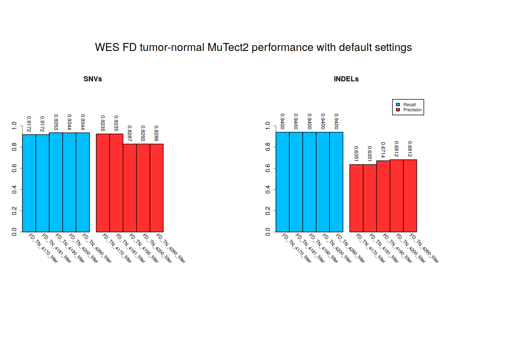
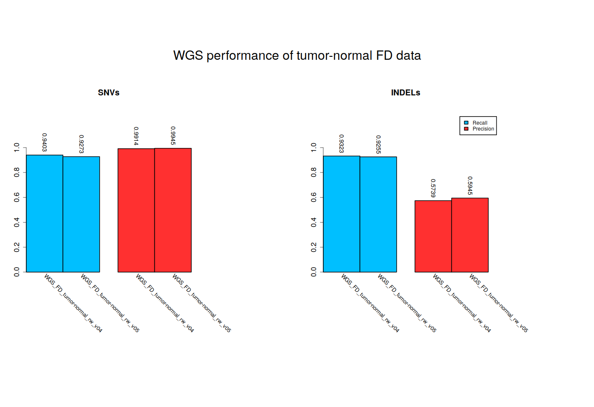
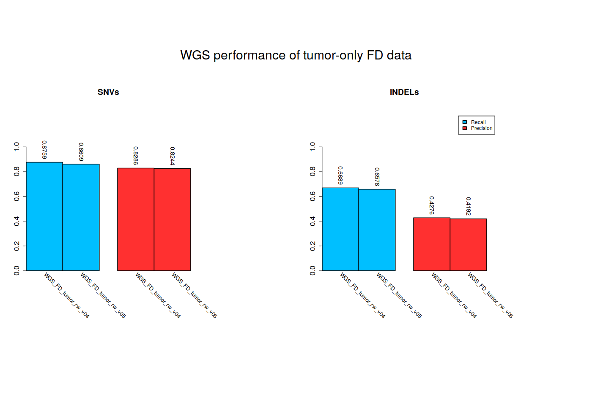
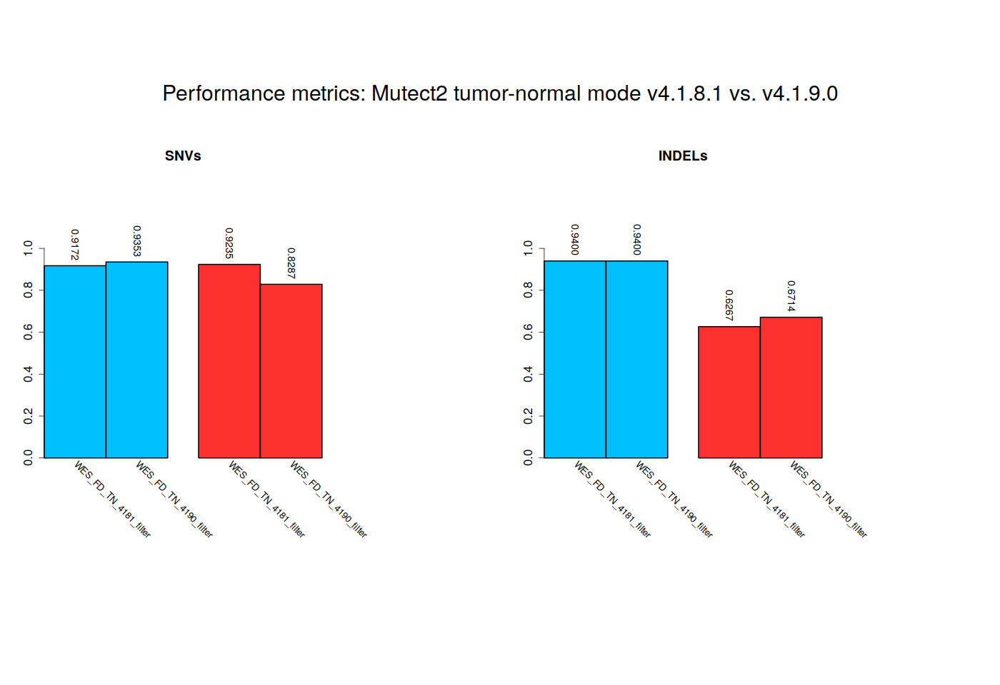

# Mutect2 calling performance bug

Documentation related to the bug resulting in drop of specificity/precision in Mutect2 between GATK v.4.1.8.1 and v4.1.9.0.

## Description

The bug was discovered by investigating a strong drop in precision for SNVs (~10% for tumor-normal mode, ~20% in tumor-only mode) between GATK releases 4.1.7.0 and 4.2.6.0.

With more testing using the HCC1395 somatic benchmark (https://pubmed.ncbi.nlm.nih.gov/34504347/) and sequencing data provided by the Somatic Mutation Working Group (Fudan University WES tumor-normal data set, 2 x 100x coverage), the drop in performance can be traced to changes between 4.1.8.1 and 4.1.9.0. 

The reads were aligned to GRCh38.primary_assembly.genome:
(http://ftp.ebi.ac.uk/pub/databases/gencode/Gencode_human/release_33/GRCh38.primary_assembly.genome.fa.gz)[http://ftp.ebi.ac.uk/pub/databases/gencode/Gencode_human/release_33/GRCh38.primary_assembly.genome.fa.gz]

The alignment was performed using (bwa)[https://github.com/lh3/bwa]:
`
bwa mem -M -O 6 -A 1 -B 4 -t 7 -E 1 -k 19 
`
with a subsequent run of (picard MarkDuplicates)[https://broadinstitute.github.io/picard/].

The calling was done with essentially default parameters:
`
tools/gatk-${version}/gatk Mutect2  --normal-sample WES_FD_N --output $outvcf --intervals $wesbed  --interval-padding 0 --input $inbam_t --input $inbam_n --reference $ref
`

`
tools/gatk-${version}/gatk FilterMutectCalls --output ${outvcf%.vcf}_filtered.vcf --variant $outvcf --intervals $wesbed --reference $ref --stats ${outvcf}.stats --threshold-strategy OPTIMAL_F_SCORE --f-score-beta 1.0
`

som.py was used for calculating performance metrics.

The performance metrics for selected GATK releases:

Curiously, we do not observe such a substantial drop in precision in WGS data, neither in tumor-only nor in tumor-normal mode.
In the foillowing, our "v04" corresponds to gatk 4.1.7.0 and out "v05" corresponds to gatk 4.2.6.0:

Tumor-normal:

Tumor-only:

## Reproducing the bug

Aligned reads are available from Google Drive:

Normal tissue:
* (WES_FD_N.bam)[https://drive.google.com/file/d/1YYiALZeUjtpivCZlTQhrQejV8yiutfdl/view?usp=share_link]
(WES_FD_N.bam.bai)[https://drive.google.com/file/d/1YYiALZeUjtpivCZlTQhrQejV8yiutfdl/view?usp=share_link]

Tumor tissue:
* (WES_FD_T.bam)[https://drive.google.com/file/d/1KKwCGl3PZh6rmmj3xSlPuVum48QaqBPi/view?usp=share_link]
* (WES_FD_T.bam.bai)[https://drive.google.com/file/d/1YYiALZeUjtpivCZlTQhrQejV8yiutfdl/view?usp=share_link]

Calling was performed with Mutect2 from various (releases of GATK)[https://github.com/broadinstitute/gatk/releases], for v4.1.8.1 and v4.1.9.0 specifically using the commands:

`
wesbed=intervals/S07604624_Covered_human_all_v6_plus_UTR.liftover.to.hg38_merged_allowed_contigs_intersect_HighConfidence.bed
`

`
outvcf=vcfs/WES_FD_TN_4181.vcf.gz
`

`
$tools/gatk-4.1.8.1/gatk Mutect2  --normal-sample WES_FD_N --output $outvcf  --intervals $wesbed   --interval-padding 0 --input $inbam_t --input $inbam_n --reference $ref
`

`
$tools/gatk-4.1.8.1/gatk FilterMutectCalls  --output ${outvcf%.vcf.gz}_filtered.vcf.gz  --variant $outvcf --intervals $wesbed --reference $ref --stats ${outvcf}.stats --threshold-strategy OPTIMAL_F_SCORE --f-score-beta 1.0
`

`
wesbed=intervals/S07604624_Covered_human_all_v6_plus_UTR.liftover.to.hg38_merged_allowed_contigs_intersect_HighConfidence.bed
`

`
outvcf=vcfs/WES_FD_TN_4190.vcf.gz
`

`
$tools/gatk-4.1.9.0/gatk Mutect2  --normal-sample WES_FD_N --output $outvcf  --intervals $wesbed   --interval-padding 0 --input $inbam_t --input $inbam_n --reference $ref
`

`
$tools/gatk-4.1.9.0/gatk FilterMutectCalls  --output ${outvcf%.vcf.gz}_filtered.vcf.gz  --variant $outvcf --intervals $wesbed --reference $ref --stats ${outvcf}.stats --threshold-strategy OPTIMAL_F_SCORE --f-score-beta 1.0
`

The output as vcf files are available here:
* [vcfs/WES_FD_TN_4181_filtered.vcf.gz](vcfs/WES_FD_TN_4181_filtered.vcf.gz)
* [vcfs/WES_FD_TN_4190_filtered.vcf.gz](vcfs/WES_FD_TN_4181_filtered.vcf.gz)

The combined (SNVs and INDELs) benchmark reference [benchmark/high-confidence_sSNV_sINDEL_in_HC_regions_v1.2.vcf.gz](benchmark/high-confidence_sSNV_sINDEL_in_HC_regions_v1.2.vcf.gz) was created using [src/get_benchmark_calls.sh](src/get_benchmark_calls.sh).

For reproducing performance metrics [callsets_performance/WES_FD_TN_4181_filter_som_py.stats.csv](callsets_performance/WES_FD_TN_4181_filter_som_py.stats.csv) and [callsets_performance/WES_FD_TN_4190_filter_som_py.stats.csv](callsets_performance/WES_FD_TN_4190_filter_som_py.stats.csv), change to src/ directory and:
* install hap.py using [src/get_hap_py.sh](src/get_hap_py.sh)
* get reference fasta using [src/get_hap_py.sh](src/get_reference_fasta.sh)
* run som.py using [src/run_callsets_performance.sh](src/run_callsets_performance.sh)

To generate the following figure, change to src/ and execute [plot_performance_metrics.sh](src/plot_performance_metrics.sh).

## Original bug report

See (https://github.com/broadinstitute/gatk/issues/7921)[https://github.com/broadinstitute/gatk/issues/7921]
